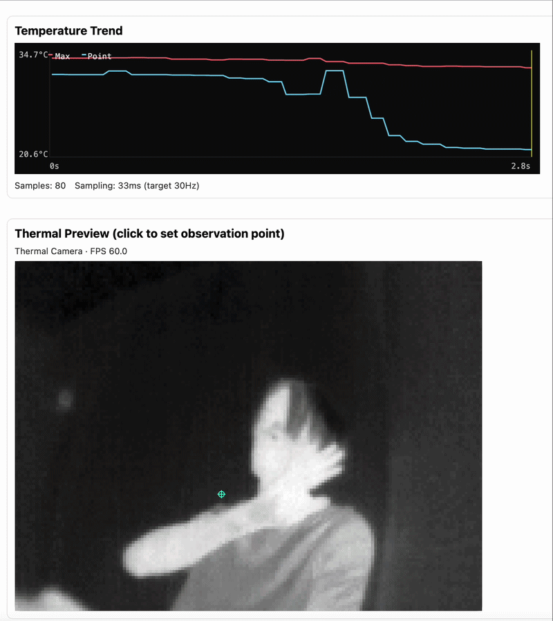

# purethermal-websocket

A minimal WebSocket server that captures 16‑bit grayscale (Y16) frames from UVC devices (e.g., PureThermal + FLIR Lepton) via libuvc and streams them to clients.

Wire format: a fixed 32‑byte header followed by pixel data as little‑endian `uint16` values (`width × height`). Clients should read the header first, then consume `width × height` `uint16` samples and interpret them as temperature/intensity; the scaling factor is provided in the header’s `scale` field. See `FrameHeader` in `main.cpp` for the exact layout.

Networking is implemented with Boost.Asio/Beast. Use `--mode pt3` for real hardware (libuvc) and `--mode dummy` for the synthetic frames.

## Demo



The demo client shown above is [webcv-platform](https://github.com/kzkymur/webcv-platform).

## Build

Lepton SDK based FFC control is always enabled.  
The SDK is consumed from the submodule at `external/GetThermal/lepton_sdk`.

```sh
# after clone / on update
git submodule update --init --recursive

# build
cmake -S . -B build
cmake --build build -j
```

## Run

```sh
sudo ./lepton_ws_server --mode pt3
```

### Run (scale=10)

```sh
./lepton_ws_server --mode dummy --scale 10 --fps 9
```

### Dummy Mode

```sh
./lepton_ws_server --mode dummy
```

### Options

- `--mode dummy|pt3` (default: `dummy`)
- `--port <num>` (default: `8765`)
- `--fps auto|NUM` (default: `auto`)
- `--scale NUM` (default: `100`, `Kelvin = value / scale`)
- `--assume-tlinear` (default: ON, `format=1` / `scale=--scale`)
- `--no-assume-tlinear` (stream with `format=0` / `scale=0`)
- `--ffc-mode manual|auto|external` (default: `manual`)

## FFC Control

- Send `ffc` (text) from a WebSocket client to request FFC.
- Sending a single-byte binary payload `0x01` triggers the same FFC request.
- FFC control is active in `--mode pt3`.
- Shutter mode is selected at runtime with `--ffc-mode` (applied at startup and on each `ffc` request).

### Send `ffc` from a client (Python)

```sh
python scripts/send_ffc.py
# or
./scripts/send_ffc.py
# optional: binary trigger
python scripts/send_ffc.py --binary
```

## Client Decode Example (Python)

```python
import asyncio
import struct
import websockets

async def main():
    async with websockets.connect("ws://127.0.0.1:8765") as ws:
        buf = await ws.recv()
        hdr = struct.unpack("<4sHHHHHHHQLH", buf[:32])
        magic, version, header_bytes, width, height, fmt, scale, _, ts_us, frame_id, _ = hdr
        assert magic == b"L3R1" and header_bytes == 32
        assert version == 1
        pixels = struct.unpack("<" + "H" * (width * height), buf[32:32 + width * height * 2])
        kelvin0 = pixels[0] / scale
        print(version, width, height, scale, frame_id, kelvin0)

asyncio.run(main())
```
